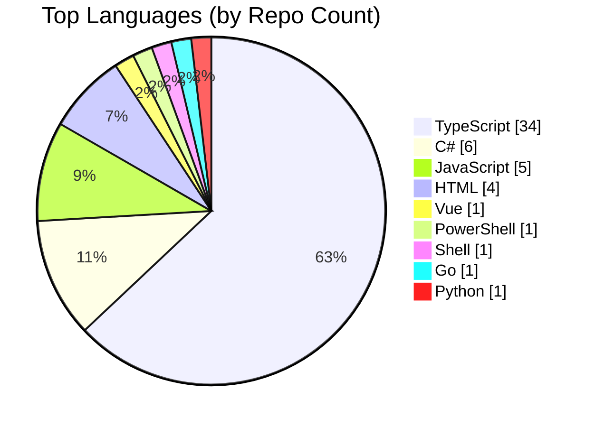
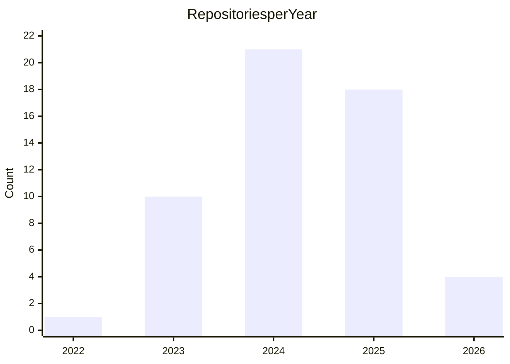
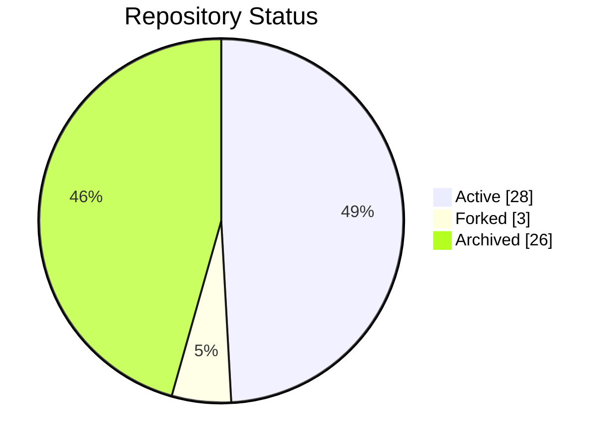

#### Table of Contents

- [Latest Content](#latest-content)
- [Latest Activity](#latest-activity)
- [Statistics](#statistics)
  - [Languages](#languages)
  - [Repositories Created per Year](#repositories-created-per-year)
  - [Repository Distribution](#repository-distribution)
- [Repositories](#repositories)
  - [Active Repositories](#active-repositories)
  - [Forked Repositories](#forked-repositories)
  - [Archived Repositories](#archived-repositories)
- [Contact](#contact)

## Latest Content

- [**Golter**](https://sametcc.me/project/golter) *(Jan 17, 2026)* A terminal-based file converter with a modern TUI, built with Go. Supports batch conversion of image...

- [**Payload Docker Config: PostgreSQL + BunJS**](https://sametcc.me/gist/payload-docker-config-pgsql-bunjs) *(Dec 25, 2025)* Docker configuration files to run PayloadCMS using the Bun runtime and PostgreSQL database. 

- [**Migrate from prettier-eslint to Biome**](https://sametcc.me/gist/migrate-from-prettier-eslint-to-biome) *(Dec 24, 2025)* A fully automated Bash script to migrate from ESLint + Prettier to Biome. It initializes Biome, migr...

- [**Insta Public Archiver**](https://sametcc.me/gist/insta-public-archiver) *(Dec 23, 2025)* A Python script to download all media from public Instagram profiles without login.

- [**Tracing Edgar Allan Poe's Ghost in the Fog of Silent Hill**](https://sametcc.me/blog/tracing-edgar-allan-poes-ghost-in-the-fog-of-silent-hill) *(Dec 17, 2025)* An analysis of the deep, foundational connections that bind Edgar Allan Poe's literary universe to t...

- [**Running Calibre-Web on Coolify**](https://sametcc.me/gist/running-calibre-on-coolify) *(Oct 15, 2025)* A comprehensive guide to deploying Calibre-Web on Coolify with Docker Compose and persistent storage

- [**GitHub Profile Viewer**](https://sametcc.me/project/github-profile-viewer) *(Oct 15, 2025)* A dynamic web platform that transforms how you explore GitHub profiles, built with Blazor and .NET. ...

- [**Mermaid Live Editor & Viewer**](https://sametcc.me/project/mermaid-viewer) *(Apr 23, 2025)* A powerful web application built with Next.js, React, and TypeScript that allows users to create, ed...

- [**VitePress Mermaid Renderer**](https://sametcc.me/project/vitepress-mermaid-renderer) *(Mar 15, 2025)* A VitePress plugin that transforms static Mermaid diagrams into interactive, dynamic visualizations ...

- [**Env Protector**](https://sametcc.me/project/env-protector) *(Sep 14, 2024)* A Visual Studio Code extension that enhances the security of environment files by masking sensitive ...

Show 13 more posts...

- [**Using JSON Schema in VS Code**](https://sametcc.me/gist/using-json-schema-in-vscode) *(Aug 25, 2024)* Step-by-step guide to implementing JSON Schema validation in VS Code for automatic error detection a...

- [**Docker Command Documentation**](https://sametcc.me/gist/docker-commands) *(Aug 25, 2024)* Comprehensive guide to Docker commands for containerization, image management, and container orchest...

- [**TypeScript Types and Utility Types**](https://sametcc.me/gist/typescript-types) *(Aug 25, 2024)* Complete guide to TypeScript's built-in utility types, advanced type transformations, and custom typ...

- [**Using Glob Patterns in TypeScript Projects**](https://sametcc.me/gist/typescript-glob-patterns) *(Aug 25, 2024)* Comprehensive guide to glob patterns in TypeScript with detailed character explanations, examples, a...

- [**Product Requirements Document**](https://sametcc.me/gist/product-requirement-doc-guide) *(Aug 25, 2024)* Complete guide to writing effective Product Requirements Documents (PRDs) with templates, best pract...

- [**React Component Lifecycle**](https://sametcc.me/gist/react-component-lifecycle) *(Aug 25, 2024)* Deep dive into React component lifecycle methods, hooks, and modern patterns for managing component ...

- [**A Comprehensive Guide to Creating and Using Tasks in Visual Studio Code**](https://sametcc.me/gist/using-tasks-in-vscode) *(Aug 25, 2024)* Complete guide to VS Code tasks configuration including custom tasks, automation, debugging, and int...

- [**Git Hooks: A Comprehensive Guide**](https://sametcc.me/gist/git-hooks-guide) *(Aug 25, 2024)* Complete guide to Git hooks implementation, best practices, and advanced automation techniques for c...

- [**Script Gists**](https://sametcc.me/gist/scripts-gist) *(Aug 25, 2024)* Collection of useful development scripts including Prettier setup, Git utilities, and automation too...

- [**Running Scripts in Linux**](https://sametcc.me/gist/running-scripts-in-linux) *(Aug 25, 2024)* Essential guide to running scripts in Linux including permissions, execution methods, and best pract...

- [**PowerShell Scripting**](https://sametcc.me/gist/powershell-scripting) *(Aug 25, 2024)* Complete PowerShell scripting guide covering automation, DevOps practices, Azure integration, and ad...

- [**Electron Widgets**](https://sametcc.me/project/electron-widgets) *(Mar 25, 2024)* A desktop application built with Electron.js and Node.js that allows users to create and manage cust...

- [**Resume Builder**](https://sametcc.me/project/resume-builder) *(Jan 12, 2023)* A desktop application developed with C# and Windows Forms that allows users to create, manage, and e...

## Latest Activity

- **Created branch `main` in [sametcn99/sametcn99](https://github.com/sametcn99/sametcn99)** *(Jan 26, 2026)*
- **Merged pull request [#3](undefined) in [mogretici/nestlens](https://github.com/mogretici/nestlens)** *(Jan 25, 2026)*
- **Opened pull request [#3](undefined) in [mogretici/nestlens](https://github.com/mogretici/nestlens)** *(Jan 25, 2026)*
- **Forked [mogretici/nestlens](https://github.com/mogretici/nestlens) to [sametcn99/nestlens](https://github.com/sametcn99/nestlens)** *(Jan 25, 2026)*
- **Starred [mogretici/nestlens](https://github.com/mogretici/nestlens)** *(Jan 24, 2026)*
- **Starred [barats/resizem](https://github.com/barats/resizem)** *(Jan 22, 2026)*
- **Starred [wailsapp/wails](https://github.com/wailsapp/wails)** *(Jan 22, 2026)*
- **Starred [linkwarden/linkwarden](https://github.com/linkwarden/linkwarden)** *(Jan 22, 2026)*
- **Starred [sametirkoren/pharmacy-scraper](https://github.com/sametirkoren/pharmacy-scraper)** *(Jan 20, 2026)*
- **Starred [sametirkoren/pharmacy-on-duty](https://github.com/sametirkoren/pharmacy-on-duty)** *(Jan 20, 2026)*

Show 40 more activities...

- **Starred [unkn0wn-root/resterm](https://github.com/unkn0wn-root/resterm)** *(Jan 18, 2026)*
- **Published release [0.1.3](https://github.com/sametcn99/golter/releases/tag/0.1.3) in [sametcn99/golter](https://github.com/sametcn99/golter)** *(Jan 18, 2026)*
- **Published release [0.1.2](https://github.com/sametcn99/golter/releases/tag/0.1.2) in [sametcn99/golter](https://github.com/sametcn99/golter)** *(Jan 17, 2026)*
- **Published release [0.1.1](https://github.com/sametcn99/golter/releases/tag/0.1.1) in [sametcn99/golter](https://github.com/sametcn99/golter)** *(Jan 17, 2026)*
- **Created branch `main` in [sametcn99/golter-web](https://github.com/sametcn99/golter-web)** *(Jan 17, 2026)*
- **Published release [0.1.0](https://github.com/sametcn99/golter/releases/tag/0.1.0) in [sametcn99/golter](https://github.com/sametcn99/golter)** *(Jan 17, 2026)*
- **Created branch `master` in [sametcn99/golter](https://github.com/sametcn99/golter)** *(Jan 16, 2026)*
- **Starred [home-sweet-gnome/dash-to-panel](https://github.com/home-sweet-gnome/dash-to-panel)** *(Jan 15, 2026)*
- **Starred [sindresorhus/notifier-for-github](https://github.com/sindresorhus/notifier-for-github)** *(Jan 14, 2026)*
- **Starred [coollabsio/fonts](https://github.com/coollabsio/fonts)** *(Jan 14, 2026)*
- **Deleted branch `dependabot/npm_and_yarn/npm_and_yarn-5134b82be1` in [sametcn99/nextui-blog-template](https://github.com/sametcn99/nextui-blog-template)** *(Jan 14, 2026)*
- **Closed pull request [#2](undefined) in [sametcn99/nextui-blog-template](https://github.com/sametcn99/nextui-blog-template)** *(Jun 21, 2024)*
- **Commented on issue [#8](https://github.com/sametcn99/env-protector/issues/8) in [sametcn99/env-protector](https://github.com/sametcn99/env-protector)** *(Jan 13, 2026)*
- **Assigned issue [#8](https://github.com/sametcn99/env-protector/issues/8) in [sametcn99/env-protector](https://github.com/sametcn99/env-protector)** *(Jan 13, 2026)*
- **Labeled issue [#8](https://github.com/sametcn99/env-protector/issues/8) in [sametcn99/env-protector](https://github.com/sametcn99/env-protector)** *(Jan 13, 2026)*
- **Commented on issue [#8](https://github.com/sametcn99/env-protector/issues/8) in [sametcn99/env-protector](https://github.com/sametcn99/env-protector)** *(Jan 13, 2026)*
- **Published release [1.0.12](https://github.com/sametcn99/env-protector/releases/tag/1.0.12) in [sametcn99/env-protector](https://github.com/sametcn99/env-protector)** *(Jan 12, 2026)*
- **Deleted tag `1.0.11` in [sametcn99/env-protector](https://github.com/sametcn99/env-protector)** *(Jan 12, 2026)*
- **Starred [AnmolSaini16/mapcn](https://github.com/AnmolSaini16/mapcn)** *(Jan 11, 2026)*
- **Commented on issue [#7](https://github.com/sametcn99/env-protector/issues/7) in [sametcn99/env-protector](https://github.com/sametcn99/env-protector)** *(Jan 11, 2026)*
- **Starred [NodeDaemon/NodeDaemon](https://github.com/NodeDaemon/NodeDaemon)** *(Jan 11, 2026)*
- **Labeled issue [#7](https://github.com/sametcn99/env-protector/issues/7) in [sametcn99/env-protector](https://github.com/sametcn99/env-protector)** *(Jan 10, 2026)*
- **Assigned issue [#7](https://github.com/sametcn99/env-protector/issues/7) in [sametcn99/env-protector](https://github.com/sametcn99/env-protector)** *(Jan 10, 2026)*
- **Commented on issue [#7](https://github.com/sametcn99/env-protector/issues/7) in [sametcn99/env-protector](https://github.com/sametcn99/env-protector)** *(Jan 10, 2026)*
- **Commented on issue [#7](https://github.com/sametcn99/env-protector/issues/7) in [sametcn99/env-protector](https://github.com/sametcn99/env-protector)** *(Jan 10, 2026)*
- **Deleted branch `dependabot/npm_and_yarn/npm_and_yarn-2cb8645c2b` in [sametcn99/color-img-downloader](https://github.com/sametcn99/color-img-downloader)** *(Jan 10, 2026)*
- **Closed pull request [#1](undefined) in [sametcn99/color-img-downloader](https://github.com/sametcn99/color-img-downloader)** *(Oct 12, 2025)*
- **Starred [EclipseFdn/open-vsx.org](https://github.com/EclipseFdn/open-vsx.org)** *(Jan 10, 2026)*
- **Labeled issue [#7278](https://github.com/EclipseFdn/open-vsx.org/issues/7278) in [EclipseFdn/open-vsx.org](https://github.com/EclipseFdn/open-vsx.org)** *(Jan 10, 2026)*
- **Labeled issue [#7278](https://github.com/EclipseFdn/open-vsx.org/issues/7278) in [EclipseFdn/open-vsx.org](https://github.com/EclipseFdn/open-vsx.org)** *(Jan 10, 2026)*
- **Opened issue [#7278](https://github.com/EclipseFdn/open-vsx.org/issues/7278) in [EclipseFdn/open-vsx.org](https://github.com/EclipseFdn/open-vsx.org)** *(Jan 10, 2026)*
- **Deleted branch `fullstack-dev` in [sametcn99/mermaid-viewer](https://github.com/sametcn99/mermaid-viewer)** *(Jan 9, 2026)*
- **Merged pull request [#6](undefined) in [sametcn99/mermaid-viewer](https://github.com/sametcn99/mermaid-viewer)** *(Jan 9, 2026)*
- **Opened pull request [#6](undefined) in [sametcn99/mermaid-viewer](https://github.com/sametcn99/mermaid-viewer)** *(Jan 9, 2026)*
- **Merged pull request [#5](undefined) in [sametcn99/mermaid-viewer](https://github.com/sametcn99/mermaid-viewer)** *(Jan 9, 2026)*
- **Opened pull request [#5](undefined) in [sametcn99/mermaid-viewer](https://github.com/sametcn99/mermaid-viewer)** *(Jan 9, 2026)*
- **Created branch `fullstack-dev` in [sametcn99/mermaid-viewer](https://github.com/sametcn99/mermaid-viewer)** *(Jan 5, 2026)*
- **Created branch `master` in [sametcn99/instaloader-api](https://github.com/sametcn99/instaloader-api)** *(Jan 4, 2026)*
- **Starred [marhensa/instaloader-gui-wrapper](https://github.com/marhensa/instaloader-gui-wrapper)** *(Jan 4, 2026)*
- **Starred [booklore-app/booklore](https://github.com/booklore-app/booklore)** *(Jan 4, 2026)*

## Statistics

### Languages

### Repositories Created per Year

### Repository Distribution

## Repositories

### Active Repositories

| Repository | Description | Created / Last Commit |
|------------|-------------|-----------------------|
| [vitepress-mermaid-renderer](https://sametcc.me/repo/vitepress-mermaid-renderer) ★34 - TypeScript | Transform your static Mermaid diagrams into interactive, dynamic visualizations in VitePress! This powerful plugin brings life to your documentation by enabling interactive features like zooming, panning, and fullscreen viewing. | 03/15/2025 01/08/2026 |
| [electron-widgets](https://sametcc.me/repo/electron-widgets) ★20 - TypeScript | the missing html based widget manager application | 03/24/2024 12/19/2025 |
| [env-protector](https://sametcc.me/repo/env-protector) ★15 - TypeScript | Protect your secrets from being exposed | 09/14/2024 01/12/2026 |
| [nextui-blog-template](https://sametcc.me/repo/nextui-blog-template) ★12 - TypeScript | The Next UI Blog Template is a powerful foundation for crafting your very own blog website using Next.js, coupled with sleek UI components from Next UI. This template not only jumpstarts your project but also ensures a responsive and customizable blog experience. | 11/02/2023 01/14/2026 |
| [mermaid-viewer](https://sametcc.me/repo/mermaid-viewer) ★7 - TypeScript | A powerful, modern web application that transforms your ideas into stunning diagrams with live preview and instant sharing capabilities. | 04/23/2025 01/24/2026 |
| [markdown-file-renamer-web-app](https://sametcc.me/repo/markdown-file-renamer-web-app) ★4 - TypeScript | This project is a web application that allows users to upload Markdown files, store them locally, and later download the files with renamed filenames. It has been created to help develop the NextUI Blog Template project. | 11/05/2023 10/20/2025 |
| [reddit-rss-api](https://sametcc.me/repo/reddit-rss-api) ★3 - TypeScript | This project appears to be a Deno-based server application that serves as an API for fetching Reddit posts from rss feed. It provides several endpoints to fetch posts from one or more subreddits. | 05/16/2024 11/04/2025 |
| [clone-all-gists](https://sametcc.me/repo/clone-all-gists) ★3 - TypeScript | This script downloads all public gists for a specified GitHub user and saves them to the local filesystem. The gists are organized by username and gist ID. | 08/26/2024 10/27/2025 |
| [GPVBlazor](https://sametcc.me/repo/GPVBlazor) ★2 - HTML | This platform provides a comprehensive and user-friendly interface for exploring GitHub profiles and gaining valuable insights into developers' open-source contributions. | 06/26/2024 01/14/2026 |
| [color-img-downloader](https://sametcc.me/repo/color-img-downloader) ★2 - TypeScript | Color Studio is a professional-grade color picker and image generation tool built with modern web technologies. Create, manipulate, and export beautiful colors in multiple formats with an intuitive and powerful interface. | 07/14/2025 01/10/2026 |
| [write-lyric-to-audio](https://sametcc.me/repo/write-lyric-to-audio) ★2 - JavaScript | This project is designed to fetch and display metadata for audio files, specifically focusing on .flac and .mp3 formats. It also integrates with the Genius API to retrieve lyrics for the songs based on the metadata obtained. The project utilizes Deno for runtime and leverages various npm packages for metadata parsing and lyrics fetching. | 05/04/2024 09/13/2025 |
| [catchapage](https://sametcc.me/repo/catchapage) ★2 - TypeScript | an automated page capture toolkit that crawls a curated list of URLs, renders each page in multiple device profiles, and saves both the rendered HTML and a full-page screenshot for every variation.  | 11/03/2025 11/04/2025 |
| [open-on-gpv-crx](https://sametcc.me/repo/open-on-gpv-crx) ★2 - JavaScript | This Chrome extension allows you to easily open a GitHub Profile on Github Profile Viewer Website. | 01/20/2024 08/04/2024 |
| [svg-split](https://sametcc.me/repo/svg-split) ★1 - JavaScript | No description provided. | 03/13/2025 07/22/2025 |
| [electron-widgets-web](https://sametcc.me/repo/electron-widgets-web) ★1 - Vue | No description provided. | 04/03/2024 10/18/2025 |
| [vitepress-mermaid-renderer-web](https://sametcc.me/repo/vitepress-mermaid-renderer-web) ★1 - TypeScript | No description provided. | 10/14/2025 01/11/2026 |
| [xls-to-gantt](https://sametcc.me/repo/xls-to-gantt) ★1 - TypeScript | A powerful and user-friendly tool for converting Excel files directly into interactive Gantt charts. Perfect for project managers, team leaders, and anyone who wants to visualize project timelines without the hassle of manual chart creation. | 04/22/2025 12/16/2025 |
| [sametcn99.github.io](https://sametcc.me/repo/sametcn99.github.io) ★1 - HTML | redirect to personal website | 01/06/2024 10/25/2025 |
| [fullstack-template](https://sametcc.me/repo/fullstack-template) ★1 - TypeScript | A modern, production-ready fullstack template for rapid application development. This template provides a solid foundation for building scalable web applications with a React frontend and NestJS backend, all powered by modern tooling and best practices. | 09/06/2025 09/06/2025 |
| [dotfiles](https://sametcc.me/repo/dotfiles) ★1 - Shell | No description provided. | 10/16/2025 10/16/2025 |
| [sql-query-safety-checker](https://sametcc.me/repo/sql-query-safety-checker) ★1 - TypeScript | A comprehensive TypeScript library for analyzing SQL queries and detecting potential security threats, including SQL injection patterns, dangerous operations, and data modification commands. Perfect for applications that need to validate user-provided SQL queries before execution. | 06/11/2025 06/19/2025 |
| [ResumeBuilderMAUI](https://sametcc.me/repo/ResumeBuilderMAUI) ★1 - C# | I’m currently learning .NET MAUI and MVVM architecture as I rebuild my ResumeBuilder app. This project is a work in progress, and I’m gaining knowledge as I proceed. | 06/04/2024 06/11/2024 |
| [sametcn99](https://sametcc.me/repo/sametcn99) - TypeScript | No description provided. | 01/25/2026 01/26/2026 |
| [golter-web](https://sametcc.me/repo/golter-web) - TypeScript | golter landing page | 01/17/2026 01/18/2026 |
| [golter](https://sametcc.me/repo/golter) - Go | Terminal-based file converter built with Go | 01/16/2026 01/18/2026 |
| [orhan-elektronik](https://sametcc.me/repo/orhan-elektronik) - TypeScript | No description provided. | 01/01/2025 01/04/2026 |
| [instaloader-api](https://sametcc.me/repo/instaloader-api) - Python | A FastAPI-based wrapper around Instaloader that downloads Instagram profile content | 01/04/2026 01/06/2026 |
| [personal-website-blazor](https://sametcc.me/repo/personal-website-blazor) - HTML | No description provided. | 12/23/2025 12/24/2025 |

### Forked Repositories

| Repository | Description | Created / Last Commit |
|------------|-------------|-----------------------|
| [Letterboxd-to-IMDb](https://sametcc.me/repo/Letterboxd-to-IMDb) ★1 - Python | Import your Letterboxd ratings into IMDb | 06/28/2025 06/28/2025 |
| [nestlens](https://sametcc.me/repo/nestlens) - TypeScript | Laravel Telescope-inspired debugging and monitoring for NestJS. Track requests, queries, exceptions, jobs, and 14 more watchers with a beautiful real-time dashboard. | 01/25/2026 01/25/2026 |
| [RepoHub](https://sametcc.me/repo/RepoHub) - TypeScript | RepoHub provides a unified interface for package discovery and installation across different operating systems. | 12/05/2025 12/05/2025 |

### Archived Repositories

| Repository | Description | Created / Last Commit |
|------------|-------------|-----------------------|
| [ResumeBuilder](https://sametcc.me/repo/ResumeBuilder) ★14 - C# | moved to https://github.com/sametcn99/ResumeBuilderMAUI | 12/08/2022 02/07/2024 |
| [nextjs-auth-and-crud-with-supabase](https://sametcc.me/repo/nextjs-auth-and-crud-with-supabase) ★8 - TypeScript | nextjs auth and crud example with supabase. | 10/28/2023 05/10/2024 |
| [github-profile-viewer](https://sametcc.me/repo/github-profile-viewer) ★6 - TypeScript | moved: https://github.com/sametcn99/GPVBlazor | 11/23/2023 10/14/2025 |
| [nextjs-cookie-based-auth](https://sametcc.me/repo/nextjs-cookie-based-auth) ★4 - TypeScript | This project has been created to learn how to implement JSON Web Token (JWT) and cookie-based authentication for only an administrator (admin) using Next.js.  | 10/30/2023 09/18/2024 |
| [tic-tac-toe](https://sametcc.me/repo/tic-tac-toe) ★3 - TypeScript | Tic-Tac-Toe with AI is a web-based game built using React. The game provides a simple interface for playing Tic-Tac-Toe against an AI opponent. The game logic is implemented in JavaScript, and it uses the minimax algorithm to create a challenging AI opponent. | 10/28/2023 12/13/2024 |
| [code-nest-web](https://sametcc.me/repo/code-nest-web) ★2 - TypeScript | No description provided. | 07/10/2024 09/18/2024 |
| [rock-paper-scissors](https://sametcc.me/repo/rock-paper-scissors) ★2 - TypeScript | This is a simple rock-paper-scissors game built with React and Next.js. The game is played against the computer using the React Context. | 01/17/2024 06/21/2024 |
| [redux-practice](https://sametcc.me/repo/redux-practice) ★2 - TypeScript | This project is an example application created to learn the Redux library. | 12/06/2023 12/18/2024 |
| [MarkdownFileRenamer](https://sametcc.me/repo/MarkdownFileRenamer) ★2 - C# | Markdown File Renamer is a simple C# application for renaming and moving files using the titles from Markdown files. | 11/02/2023 11/02/2023 |
| [BlogAPIDotnet](https://sametcc.me/repo/BlogAPIDotnet) ★2 - C# | learning progress repo | 09/18/2024 09/27/2024 |
| [altinsaray-ds](https://sametcc.me/repo/altinsaray-ds) ★1 - TypeScript | Altın Saray Wedding Hall Website | 05/17/2024 05/23/2024 |
| [NLayerCourse](https://sametcc.me/repo/NLayerCourse) ★1 - C# | learning progress repo | 09/27/2024 10/05/2024 |
| [highcharts-v4-demo-test](https://sametcc.me/repo/highcharts-v4-demo-test) ★1 - TypeScript | No description provided. | 06/24/2025 06/25/2025 |
| [animated-search-bar](https://sametcc.me/repo/animated-search-bar) ★1 - TypeScript | two simple component to add animation to input | 12/29/2023 05/10/2024 |
| [DotNetChartJS](https://sametcc.me/repo/DotNetChartJS) ★1 - HTML | This project is initiated to test the integration of Chart.js within a .NET Blazor Web Application. | 07/09/2024 08/12/2024 |
| [mern-stack](https://sametcc.me/repo/mern-stack) ★1 - TypeScript | This project is a learning progress project aimed at mastering the MERN stack (MongoDB, Express, React, Node.js). | 09/04/2024 09/12/2024 |
| [SolidColorBackground](https://sametcc.me/repo/SolidColorBackground) ★1 - C# | This application allows users to select a color using a color picker, which updates the background color of the window. | 09/03/2024 01/24/2025 |
| [coordinat-auto-login](https://sametcc.me/repo/coordinat-auto-login) ★1 - TypeScript | No description provided. | 04/19/2025 05/04/2025 |
| [dev-manager](https://sametcc.me/repo/dev-manager) ★1 - TypeScript | A comprehensive Visual Studio Code extension that streamlines package management across multiple Node.js projects. | 03/23/2025 04/04/2025 |
| [mermaid-editor](https://sametcc.me/repo/mermaid-editor) ★1 - JavaScript | No description provided. | 02/16/2025 02/16/2025 |
| [SnipDocs](https://sametcc.me/repo/SnipDocs) ★1 - TypeScript | Instantly access clean, context-aware documentation snippets for your favorite programming languages and frameworks without leaving your code. | 05/21/2025 05/25/2025 |
| [my-vscode-profile](https://sametcc.me/repo/my-vscode-profile) ★1 - PowerShell | No description provided. | 04/20/2025 06/17/2025 |
| [open-github-dev](https://sametcc.me/repo/open-github-dev) ★1 - JavaScript | This Chrome extension allows you to easily open a GitHub repository on github.dev. | 12/20/2023 12/20/2023 |
| [node-genius-lyrics-gui](https://sametcc.me/repo/node-genius-lyrics-gui) ★1 - TypeScript | This project is an Electron application designed to interact with the Genius Lyrics API, providing a graphical user interface for fetching and writing song lyrics to audio file metadata tags. | 05/04/2024 09/27/2024 |
| [nestjs-course](https://sametcc.me/repo/nestjs-course) ★1 - TypeScript | No description provided. | 12/09/2024 12/09/2024 |
| [gists](https://sametcc.me/repo/gists) ★1 - TypeScript | moved https://sametcc.me/personal-website | 12/15/2024 04/02/2025 |

## Contact

- [Website](https://sametcc.me)
- [LinkedIn](https://sametcc.me/link/linkedin)
- [Telegram](https://sametcc.me/link/telegram)
- [Mail](https://sametcc.me/link/mail)

---

Auto-generated 
Last updated: Mon, 26 Jan 2026 01:57:49 GMT
