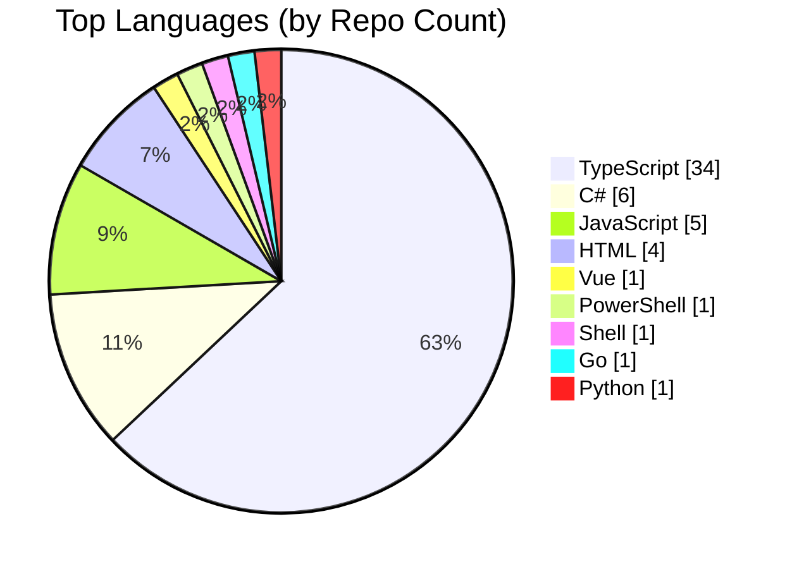
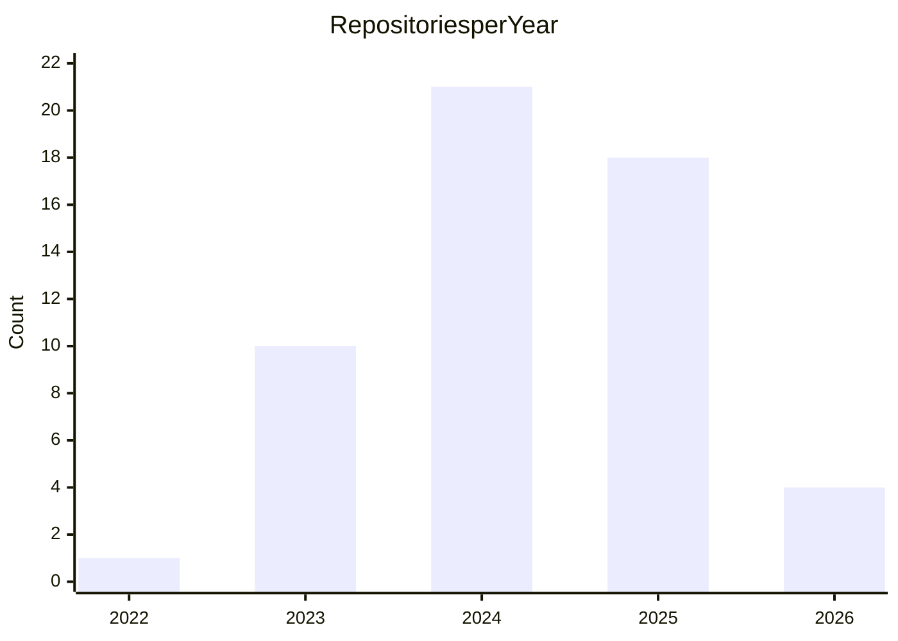
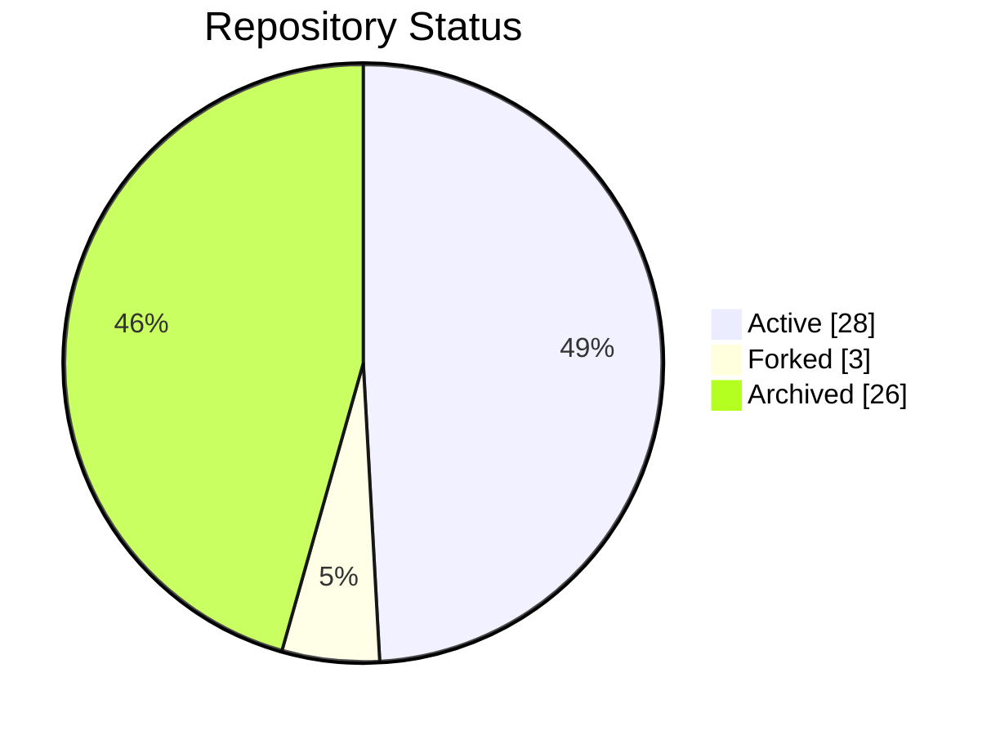

#### Table of Contents

- [Latest Content](#latest-content)
- [Statistics](#statistics)
  - [Languages](#languages)
  - [Repositories Created per Year](#repositories-created-per-year)
  - [Repository Distribution](#repository-distribution)
- [Repositories](#repositories)
  - [Active Repositories](#active-repositories)
  - [Forked Repositories](#forked-repositories)
  - [Archived Repositories](#archived-repositories)
- [Contact](#contact)

## Latest Content

- <a href="https://sametcc.me/project/golter" target="_blank" rel="noopener noreferrer"><strong>Golter</strong></a> *(Jan 17, 2026)* A terminal-based file converter with a modern TUI, built with Go. Supports batch conversion of image...

- <a href="https://sametcc.me/gist/payload-docker-config-pgsql-bunjs" target="_blank" rel="noopener noreferrer"><strong>Payload Docker Config: PostgreSQL + BunJS</strong></a> *(Dec 25, 2025)* Docker configuration files to run PayloadCMS using the Bun runtime and PostgreSQL database. 

- <a href="https://sametcc.me/gist/migrate-from-prettier-eslint-to-biome" target="_blank" rel="noopener noreferrer"><strong>Migrate from prettier-eslint to Biome</strong></a> *(Dec 24, 2025)* A fully automated Bash script to migrate from ESLint + Prettier to Biome. It initializes Biome, migr...

- <a href="https://sametcc.me/gist/insta-public-archiver" target="_blank" rel="noopener noreferrer"><strong>Insta Public Archiver</strong></a> *(Dec 23, 2025)* A Python script to download all media from public Instagram profiles without login.

- <a href="https://sametcc.me/blog/tracing-edgar-allan-poes-ghost-in-the-fog-of-silent-hill" target="_blank" rel="noopener noreferrer"><strong>Tracing Edgar Allan Poe's Ghost in the Fog of Silent Hill</strong></a> *(Dec 17, 2025)* An analysis of the deep, foundational connections that bind Edgar Allan Poe's literary universe to t...

- <a href="https://sametcc.me/gist/running-calibre-on-coolify" target="_blank" rel="noopener noreferrer"><strong>Running Calibre-Web on Coolify</strong></a> *(Oct 15, 2025)* A comprehensive guide to deploying Calibre-Web on Coolify with Docker Compose and persistent storage

- <a href="https://sametcc.me/project/github-profile-viewer" target="_blank" rel="noopener noreferrer"><strong>GitHub Profile Viewer</strong></a> *(Oct 15, 2025)* A dynamic web platform that transforms how you explore GitHub profiles, built with Blazor and .NET. ...

- <a href="https://sametcc.me/project/mermaid-viewer" target="_blank" rel="noopener noreferrer"><strong>Mermaid Live Editor & Viewer</strong></a> *(Apr 23, 2025)* A powerful web application built with Next.js, React, and TypeScript that allows users to create, ed...

- <a href="https://sametcc.me/project/vitepress-mermaid-renderer" target="_blank" rel="noopener noreferrer"><strong>VitePress Mermaid Renderer</strong></a> *(Mar 15, 2025)* A VitePress plugin that transforms static Mermaid diagrams into interactive, dynamic visualizations ...

- <a href="https://sametcc.me/project/env-protector" target="_blank" rel="noopener noreferrer"><strong>Env Protector</strong></a> *(Sep 14, 2024)* A Visual Studio Code extension that enhances the security of environment files by masking sensitive ...

## Statistics

### Languages

### Repositories Created per Year

### Repository Distribution

## Repositories

### Active Repositories

| Repository | Description | Created / Last Commit |
|------------|-------------|-----------------------|
| <a href="https://sametcc.me/repo/vitepress-mermaid-renderer" target="_blank" rel="noopener noreferrer">vitepress-mermaid-renderer</a> ★34 - TypeScript | Transform your static Mermaid diagrams into interactive, dynamic visualizations in VitePress! This powerful plugin brings life to your documentation by enabling interactive features like zooming, panning, and fullscreen viewing. | 03/15/2025 01/08/2026 |
| <a href="https://sametcc.me/repo/electron-widgets" target="_blank" rel="noopener noreferrer">electron-widgets</a> ★20 - TypeScript | the missing html based widget manager application | 03/24/2024 12/19/2025 |
| <a href="https://sametcc.me/repo/env-protector" target="_blank" rel="noopener noreferrer">env-protector</a> ★15 - TypeScript | Protect your secrets from being exposed | 09/14/2024 01/12/2026 |
| <a href="https://sametcc.me/repo/nextui-blog-template" target="_blank" rel="noopener noreferrer">nextui-blog-template</a> ★12 - TypeScript | The Next UI Blog Template is a powerful foundation for crafting your very own blog website using Next.js, coupled with sleek UI components from Next UI. This template not only jumpstarts your project but also ensures a responsive and customizable blog experience. | 11/02/2023 01/14/2026 |
| <a href="https://sametcc.me/repo/mermaid-viewer" target="_blank" rel="noopener noreferrer">mermaid-viewer</a> ★7 - TypeScript | A powerful, modern web application that transforms your ideas into stunning diagrams with live preview and instant sharing capabilities. | 04/23/2025 01/24/2026 |
| <a href="https://sametcc.me/repo/markdown-file-renamer-web-app" target="_blank" rel="noopener noreferrer">markdown-file-renamer-web-app</a> ★4 - TypeScript | This project is a web application that allows users to upload Markdown files, store them locally, and later download the files with renamed filenames. It has been created to help develop the NextUI Blog Template project. | 11/05/2023 10/20/2025 |
| <a href="https://sametcc.me/repo/reddit-rss-api" target="_blank" rel="noopener noreferrer">reddit-rss-api</a> ★3 - TypeScript | This project appears to be a Deno-based server application that serves as an API for fetching Reddit posts from rss feed. It provides several endpoints to fetch posts from one or more subreddits. | 05/16/2024 11/04/2025 |
| <a href="https://sametcc.me/repo/clone-all-gists" target="_blank" rel="noopener noreferrer">clone-all-gists</a> ★3 - TypeScript | This script downloads all public gists for a specified GitHub user and saves them to the local filesystem. The gists are organized by username and gist ID. | 08/26/2024 10/27/2025 |
| <a href="https://sametcc.me/repo/GPVBlazor" target="_blank" rel="noopener noreferrer">GPVBlazor</a> ★2 - HTML | This platform provides a comprehensive and user-friendly interface for exploring GitHub profiles and gaining valuable insights into developers' open-source contributions. | 06/26/2024 01/14/2026 |
| <a href="https://sametcc.me/repo/color-img-downloader" target="_blank" rel="noopener noreferrer">color-img-downloader</a> ★2 - TypeScript | Color Studio is a professional-grade color picker and image generation tool built with modern web technologies. Create, manipulate, and export beautiful colors in multiple formats with an intuitive and powerful interface. | 07/14/2025 01/10/2026 |
| <a href="https://sametcc.me/repo/write-lyric-to-audio" target="_blank" rel="noopener noreferrer">write-lyric-to-audio</a> ★2 - JavaScript | This project is designed to fetch and display metadata for audio files, specifically focusing on .flac and .mp3 formats. It also integrates with the Genius API to retrieve lyrics for the songs based on the metadata obtained. The project utilizes Deno for runtime and leverages various npm packages for metadata parsing and lyrics fetching. | 05/04/2024 09/13/2025 |
| <a href="https://sametcc.me/repo/catchapage" target="_blank" rel="noopener noreferrer">catchapage</a> ★2 - TypeScript | an automated page capture toolkit that crawls a curated list of URLs, renders each page in multiple device profiles, and saves both the rendered HTML and a full-page screenshot for every variation.  | 11/03/2025 11/04/2025 |
| <a href="https://sametcc.me/repo/open-on-gpv-crx" target="_blank" rel="noopener noreferrer">open-on-gpv-crx</a> ★2 - JavaScript | This Chrome extension allows you to easily open a GitHub Profile on Github Profile Viewer Website. | 01/20/2024 08/04/2024 |
| <a href="https://sametcc.me/repo/svg-split" target="_blank" rel="noopener noreferrer">svg-split</a> ★1 - JavaScript | No description provided. | 03/13/2025 07/22/2025 |
| <a href="https://sametcc.me/repo/electron-widgets-web" target="_blank" rel="noopener noreferrer">electron-widgets-web</a> ★1 - Vue | No description provided. | 04/03/2024 10/18/2025 |
| <a href="https://sametcc.me/repo/vitepress-mermaid-renderer-web" target="_blank" rel="noopener noreferrer">vitepress-mermaid-renderer-web</a> ★1 - TypeScript | No description provided. | 10/14/2025 01/11/2026 |
| <a href="https://sametcc.me/repo/xls-to-gantt" target="_blank" rel="noopener noreferrer">xls-to-gantt</a> ★1 - TypeScript | A powerful and user-friendly tool for converting Excel files directly into interactive Gantt charts. Perfect for project managers, team leaders, and anyone who wants to visualize project timelines without the hassle of manual chart creation. | 04/22/2025 12/16/2025 |
| <a href="https://sametcc.me/repo/sametcn99.github.io" target="_blank" rel="noopener noreferrer">sametcn99.github.io</a> ★1 - HTML | redirect to personal website | 01/06/2024 10/25/2025 |
| <a href="https://sametcc.me/repo/fullstack-template" target="_blank" rel="noopener noreferrer">fullstack-template</a> ★1 - TypeScript | A modern, production-ready fullstack template for rapid application development. This template provides a solid foundation for building scalable web applications with a React frontend and NestJS backend, all powered by modern tooling and best practices. | 09/06/2025 09/06/2025 |
| <a href="https://sametcc.me/repo/dotfiles" target="_blank" rel="noopener noreferrer">dotfiles</a> ★1 - Shell | No description provided. | 10/16/2025 10/16/2025 |
| <a href="https://sametcc.me/repo/sql-query-safety-checker" target="_blank" rel="noopener noreferrer">sql-query-safety-checker</a> ★1 - TypeScript | A comprehensive TypeScript library for analyzing SQL queries and detecting potential security threats, including SQL injection patterns, dangerous operations, and data modification commands. Perfect for applications that need to validate user-provided SQL queries before execution. | 06/11/2025 06/19/2025 |
| <a href="https://sametcc.me/repo/ResumeBuilderMAUI" target="_blank" rel="noopener noreferrer">ResumeBuilderMAUI</a> ★1 - C# | I’m currently learning .NET MAUI and MVVM architecture as I rebuild my ResumeBuilder app. This project is a work in progress, and I’m gaining knowledge as I proceed. | 06/04/2024 06/11/2024 |
| <a href="https://sametcc.me/repo/sametcn99" target="_blank" rel="noopener noreferrer">sametcn99</a> - TypeScript | No description provided. | 01/25/2026 01/26/2026 |
| <a href="https://sametcc.me/repo/golter-web" target="_blank" rel="noopener noreferrer">golter-web</a> - TypeScript | golter landing page | 01/17/2026 01/18/2026 |
| <a href="https://sametcc.me/repo/golter" target="_blank" rel="noopener noreferrer">golter</a> - Go | Terminal-based file converter built with Go | 01/16/2026 01/18/2026 |
| <a href="https://sametcc.me/repo/orhan-elektronik" target="_blank" rel="noopener noreferrer">orhan-elektronik</a> - TypeScript | No description provided. | 01/01/2025 01/04/2026 |
| <a href="https://sametcc.me/repo/instaloader-api" target="_blank" rel="noopener noreferrer">instaloader-api</a> - Python | A FastAPI-based wrapper around Instaloader that downloads Instagram profile content | 01/04/2026 01/06/2026 |
| <a href="https://sametcc.me/repo/personal-website-blazor" target="_blank" rel="noopener noreferrer">personal-website-blazor</a> - HTML | No description provided. | 12/23/2025 12/24/2025 |

### Forked Repositories

| Repository | Description | Created / Last Commit |
|------------|-------------|-----------------------|
| <a href="https://sametcc.me/repo/Letterboxd-to-IMDb" target="_blank" rel="noopener noreferrer">Letterboxd-to-IMDb</a> ★1 - Python | Import your Letterboxd ratings into IMDb | 06/28/2025 06/28/2025 |
| <a href="https://sametcc.me/repo/nestlens" target="_blank" rel="noopener noreferrer">nestlens</a> - TypeScript | Laravel Telescope-inspired debugging and monitoring for NestJS. Track requests, queries, exceptions, jobs, and 14 more watchers with a beautiful real-time dashboard. | 01/25/2026 01/25/2026 |
| <a href="https://sametcc.me/repo/RepoHub" target="_blank" rel="noopener noreferrer">RepoHub</a> - TypeScript | RepoHub provides a unified interface for package discovery and installation across different operating systems. | 12/05/2025 12/05/2025 |

### Archived Repositories

| Repository | Description | Created / Last Commit |
|------------|-------------|-----------------------|
| <a href="https://sametcc.me/repo/ResumeBuilder" target="_blank" rel="noopener noreferrer">ResumeBuilder</a> ★14 - C# | moved to https://github.com/sametcn99/ResumeBuilderMAUI | 12/08/2022 02/07/2024 |
| <a href="https://sametcc.me/repo/nextjs-auth-and-crud-with-supabase" target="_blank" rel="noopener noreferrer">nextjs-auth-and-crud-with-supabase</a> ★8 - TypeScript | nextjs auth and crud example with supabase. | 10/28/2023 05/10/2024 |
| <a href="https://sametcc.me/repo/github-profile-viewer" target="_blank" rel="noopener noreferrer">github-profile-viewer</a> ★6 - TypeScript | moved: https://github.com/sametcn99/GPVBlazor | 11/23/2023 10/14/2025 |
| <a href="https://sametcc.me/repo/nextjs-cookie-based-auth" target="_blank" rel="noopener noreferrer">nextjs-cookie-based-auth</a> ★4 - TypeScript | This project has been created to learn how to implement JSON Web Token (JWT) and cookie-based authentication for only an administrator (admin) using Next.js.  | 10/30/2023 09/18/2024 |
| <a href="https://sametcc.me/repo/tic-tac-toe" target="_blank" rel="noopener noreferrer">tic-tac-toe</a> ★3 - TypeScript | Tic-Tac-Toe with AI is a web-based game built using React. The game provides a simple interface for playing Tic-Tac-Toe against an AI opponent. The game logic is implemented in JavaScript, and it uses the minimax algorithm to create a challenging AI opponent. | 10/28/2023 12/13/2024 |
| <a href="https://sametcc.me/repo/code-nest-web" target="_blank" rel="noopener noreferrer">code-nest-web</a> ★2 - TypeScript | No description provided. | 07/10/2024 09/18/2024 |
| <a href="https://sametcc.me/repo/rock-paper-scissors" target="_blank" rel="noopener noreferrer">rock-paper-scissors</a> ★2 - TypeScript | This is a simple rock-paper-scissors game built with React and Next.js. The game is played against the computer using the React Context. | 01/17/2024 06/21/2024 |
| <a href="https://sametcc.me/repo/redux-practice" target="_blank" rel="noopener noreferrer">redux-practice</a> ★2 - TypeScript | This project is an example application created to learn the Redux library. | 12/06/2023 12/18/2024 |
| <a href="https://sametcc.me/repo/MarkdownFileRenamer" target="_blank" rel="noopener noreferrer">MarkdownFileRenamer</a> ★2 - C# | Markdown File Renamer is a simple C# application for renaming and moving files using the titles from Markdown files. | 11/02/2023 11/02/2023 |
| <a href="https://sametcc.me/repo/BlogAPIDotnet" target="_blank" rel="noopener noreferrer">BlogAPIDotnet</a> ★2 - C# | learning progress repo | 09/18/2024 09/27/2024 |
| <a href="https://sametcc.me/repo/altinsaray-ds" target="_blank" rel="noopener noreferrer">altinsaray-ds</a> ★1 - TypeScript | Altın Saray Wedding Hall Website | 05/17/2024 05/23/2024 |
| <a href="https://sametcc.me/repo/NLayerCourse" target="_blank" rel="noopener noreferrer">NLayerCourse</a> ★1 - C# | learning progress repo | 09/27/2024 10/05/2024 |
| <a href="https://sametcc.me/repo/highcharts-v4-demo-test" target="_blank" rel="noopener noreferrer">highcharts-v4-demo-test</a> ★1 - TypeScript | No description provided. | 06/24/2025 06/25/2025 |
| <a href="https://sametcc.me/repo/animated-search-bar" target="_blank" rel="noopener noreferrer">animated-search-bar</a> ★1 - TypeScript | two simple component to add animation to input | 12/29/2023 05/10/2024 |
| <a href="https://sametcc.me/repo/DotNetChartJS" target="_blank" rel="noopener noreferrer">DotNetChartJS</a> ★1 - HTML | This project is initiated to test the integration of Chart.js within a .NET Blazor Web Application. | 07/09/2024 08/12/2024 |
| <a href="https://sametcc.me/repo/mern-stack" target="_blank" rel="noopener noreferrer">mern-stack</a> ★1 - TypeScript | This project is a learning progress project aimed at mastering the MERN stack (MongoDB, Express, React, Node.js). | 09/04/2024 09/12/2024 |
| <a href="https://sametcc.me/repo/SolidColorBackground" target="_blank" rel="noopener noreferrer">SolidColorBackground</a> ★1 - C# | This application allows users to select a color using a color picker, which updates the background color of the window. | 09/03/2024 01/24/2025 |
| <a href="https://sametcc.me/repo/coordinat-auto-login" target="_blank" rel="noopener noreferrer">coordinat-auto-login</a> ★1 - TypeScript | No description provided. | 04/19/2025 05/04/2025 |
| <a href="https://sametcc.me/repo/dev-manager" target="_blank" rel="noopener noreferrer">dev-manager</a> ★1 - TypeScript | A comprehensive Visual Studio Code extension that streamlines package management across multiple Node.js projects. | 03/23/2025 04/04/2025 |
| <a href="https://sametcc.me/repo/mermaid-editor" target="_blank" rel="noopener noreferrer">mermaid-editor</a> ★1 - JavaScript | No description provided. | 02/16/2025 02/16/2025 |
| <a href="https://sametcc.me/repo/SnipDocs" target="_blank" rel="noopener noreferrer">SnipDocs</a> ★1 - TypeScript | Instantly access clean, context-aware documentation snippets for your favorite programming languages and frameworks without leaving your code. | 05/21/2025 05/25/2025 |
| <a href="https://sametcc.me/repo/my-vscode-profile" target="_blank" rel="noopener noreferrer">my-vscode-profile</a> ★1 - PowerShell | No description provided. | 04/20/2025 06/17/2025 |
| <a href="https://sametcc.me/repo/open-github-dev" target="_blank" rel="noopener noreferrer">open-github-dev</a> ★1 - JavaScript | This Chrome extension allows you to easily open a GitHub repository on github.dev. | 12/20/2023 12/20/2023 |
| <a href="https://sametcc.me/repo/node-genius-lyrics-gui" target="_blank" rel="noopener noreferrer">node-genius-lyrics-gui</a> ★1 - TypeScript | This project is an Electron application designed to interact with the Genius Lyrics API, providing a graphical user interface for fetching and writing song lyrics to audio file metadata tags. | 05/04/2024 09/27/2024 |
| <a href="https://sametcc.me/repo/nestjs-course" target="_blank" rel="noopener noreferrer">nestjs-course</a> ★1 - TypeScript | No description provided. | 12/09/2024 12/09/2024 |
| <a href="https://sametcc.me/repo/gists" target="_blank" rel="noopener noreferrer">gists</a> ★1 - TypeScript | moved https://sametcc.me/personal-website | 12/15/2024 04/02/2025 |

## Contact

- <a href="https://sametcc.me" target="_blank" rel="noopener noreferrer">Website</a>
- <a href="https://sametcc.me/link/linkedin" target="_blank" rel="noopener noreferrer">LinkedIn</a>
- <a href="https://sametcc.me/link/telegram" target="_blank" rel="noopener noreferrer">Telegram</a>
- <a href="https://sametcc.me/link/mail" target="_blank" rel="noopener noreferrer">Mail</a>

---

Auto-generated 
Last updated: Mon, 26 Jan 2026 01:23:36 GMT
