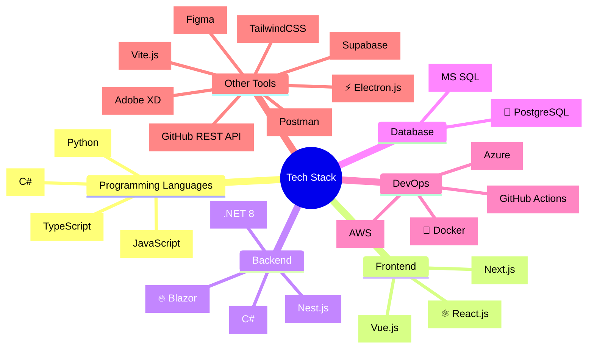

# Hello World!

```mermaid
mindmap
  root((Tech Stack))
    Programming Languages
      JavaScript["JavaScript"]
      TypeScript["TypeScript"]
      CSharp["C#"]
      Python["Python"]
    Frontend
      React.js["⚛️ React.js"]
      Next.js["Next.js"]
      Vue.js["Vue.js"]
    Backend
      NestJS["Nest.js"]
      C#["C#"]
      .NET[".NET 8"]
      Blazor["🔥 Blazor"]
    Database
      PostgreSQL["🐘 PostgreSQL"]
      MSSQL["MS SQL"]
    DevOps
      GitHubActions["GitHub Actions"]
      Azure["Azure"]
      AWS["AWS"]
      Docker["🐳 Docker"]
    Other Tools
      Electron["⚡ Electron.js"]
      GitHub["GitHub REST API"]
      Supabase["Supabase"]
      Postman["Postman"]
      Vite.js["Vite.js"]
      TailwindCSS["TailwindCSS"]
      Figma["Figma"]
      AdobeXD["Adobe XD"]
```
